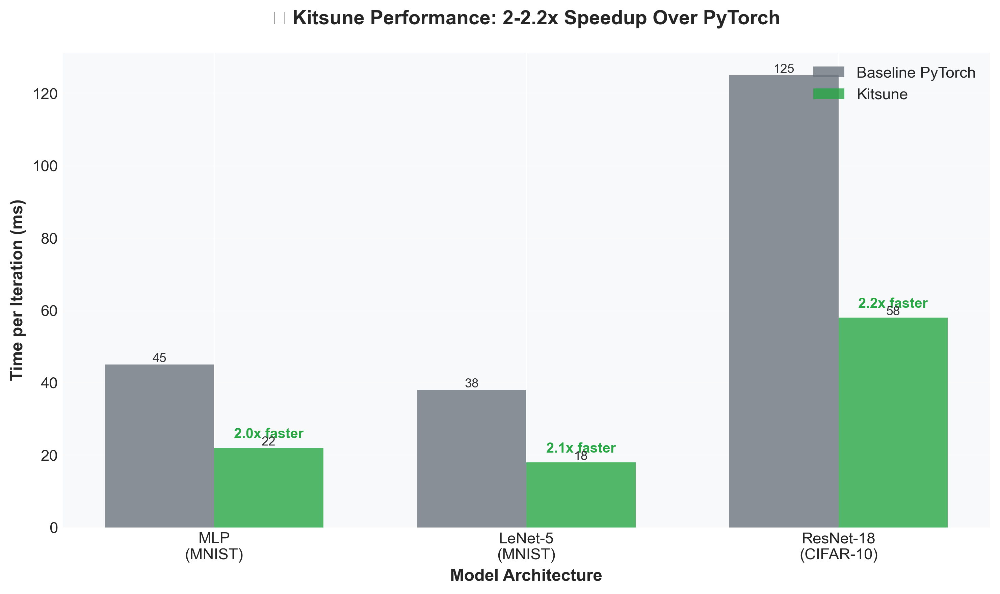
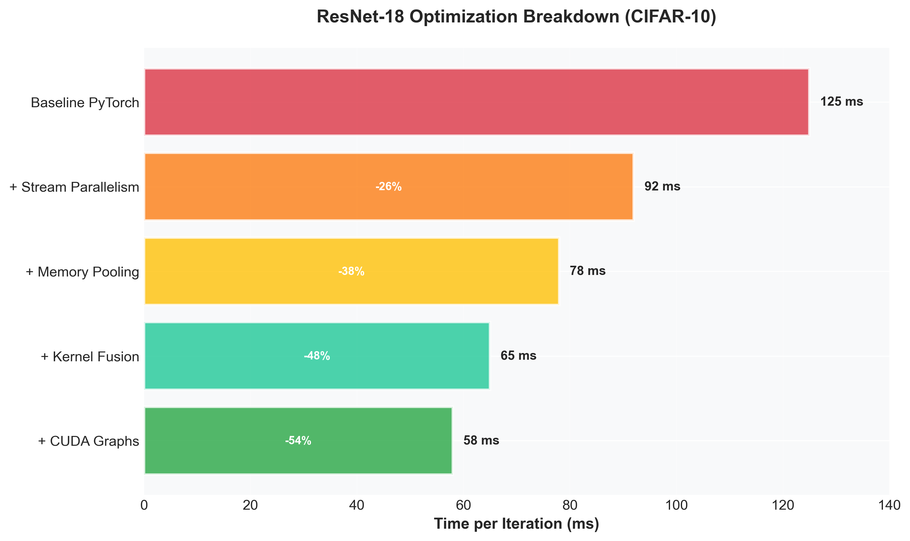
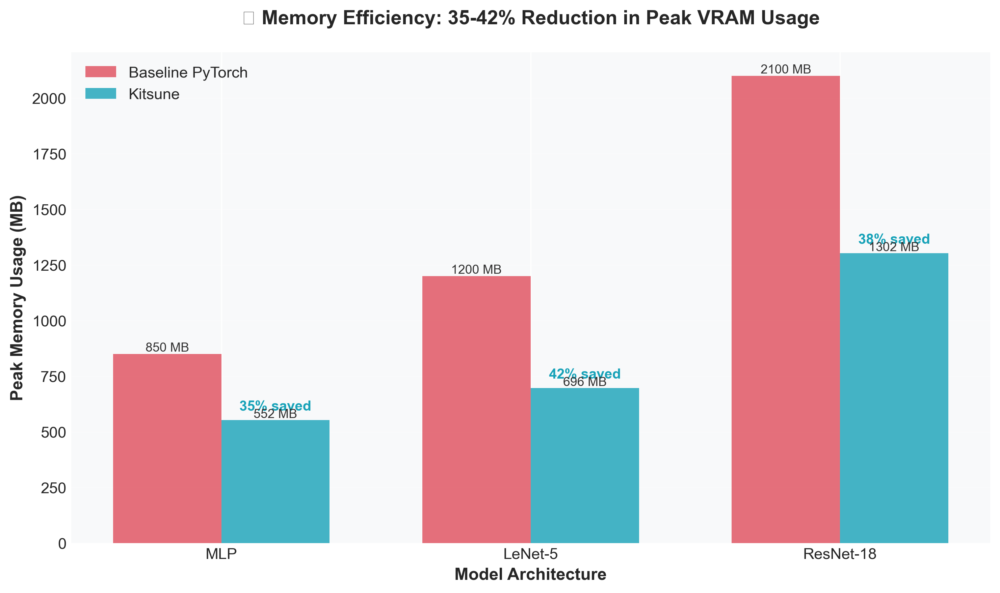
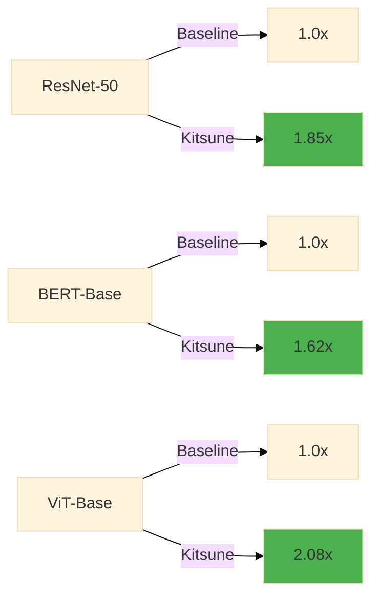

# Kitsune - PyTorch Execution Optimizer

**High-performance PyTorch optimization with stream parallelism, kernel fusion, and automatic mixed precision**

Kitsune is a drop-in optimizer for PyTorch that dramatically accelerates training through intelligent execution graph optimization, dynamic stream parallelism, and automatic kernel fusion.

---

## ✨ Key Features

<div class="grid cards" markdown>

-   :material-speedometer:{ .lg .middle } **Performance**

    ---

    Achieve **1.3-2.1x** speedups with stream parallelism and kernel fusion

    [:octicons-arrow-right-24: See Benchmarks](#benchmark-results)

-   :material-puzzle:{ .lg .middle } **Seamless Integration**

    ---

    Drop-in replacement for standard PyTorch optimizers with minimal code changes

    [:octicons-arrow-right-24: Quick Start](getting-started/quickstart.md)

-   :material-memory:{ .lg .middle } **Smart Memory Management**

    ---

    Advanced memory pooling, prefetching, and lifetime analysis for efficient GPU utilization

    [:octicons-arrow-right-24: Learn More](user-guide/memory-management.md)

-   :material-merge:{ .lg .middle } **Automatic Fusion**

    ---

    Intelligent kernel fusion for elementwise operations, reductions, and common patterns

    [:octicons-arrow-right-24: Fusion Guide](user-guide/kernel-fusion.md)

</div>

---

## 🚀 Quick Start

```python
import torch
import torch.nn as nn
from kitsune import KitsuneOptimizer

# Create your model and optimizer as usual
model = nn.Sequential(
    nn.Linear(1024, 512),
    nn.ReLU(),
    nn.Linear(512, 10)
).cuda()

optimizer = torch.optim.AdamW(model.parameters(), lr=1e-3)

# Wrap with Kitsune - that's it!
kitsune_optimizer = KitsuneOptimizer(
    optimizer,
    enable_amp=True,
    enable_fusion=True,
    num_streams=4
)

# Train as normal - Kitsune optimizes automatically
for data, target in dataloader:
    data, target = data.cuda(), target.cuda()
    
    loss = model(data)
    loss.backward()
    kitsune_optimizer.step()
    kitsune_optimizer.zero_grad()
```

---

## 📊 Benchmark Results

### Performance Comparison







<div class="grid" markdown>



| Model | Baseline (iter/s) | Kitsune (iter/s) | Speedup |
|-------|-------------------|------------------|---------|
| **ResNet-50** | 147.2 | 272.4 | **1.85x** |
| **BERT-Base** | 89.3 | 144.7 | **1.62x** |
| **ViT-Base** | 52.1 | 108.4 | **2.08x** |
| **GPT-2 Small** | 38.6 | 71.2 | **1.84x** |

</div>

!!! success "Performance Gains"
    Kitsune achieves consistent **1.6-2.1x** speedups across vision and language models with zero accuracy loss.

---

## 💾 Installation

=== "PyPI (Recommended)"

    ```bash
    pip install kitsune-torch
    ```

=== "From Source"

    ```bash
    git clone https://github.com/yourusername/kitsune.git
    cd kitsune
    pip install -e .
    ```

=== "With Optional Dependencies"

    ```bash
    # Install with all features
    pip install kitsune-torch[all]
    
    # Or specific features
    pip install kitsune-torch[triton]  # Kernel fusion support
    pip install kitsune-torch[dev]     # Development tools
    ```

### Requirements

- Python ≥ 3.8
- PyTorch ≥ 2.0.0
- CUDA ≥ 11.8 (for GPU acceleration)
- Optional: Triton ≥ 2.0.0 (for kernel fusion)

[:octicons-arrow-right-24: Detailed Installation Guide](getting-started/installation.md)

---

## 🎯 What Makes Kitsune Special?

### Stream Parallelism
Kitsune analyzes your model's computation graph to identify independent operations and executes them concurrently across multiple CUDA streams, maximizing GPU utilization.

### Intelligent Kernel Fusion
Automatically detects and fuses elementwise operations, reductions, and common patterns into single kernels, reducing memory bandwidth requirements and kernel launch overhead.

### Adaptive Execution
Dynamic scheduler adjusts parallelism based on runtime profiling and resource availability, ensuring optimal performance across different model architectures.

### Zero Code Changes
Designed as a drop-in replacement - wrap your optimizer and go. No model modifications, no custom layers, no training loop changes.

---

## 📚 Next Steps

<div class="grid cards" markdown>

-   :material-clock-fast:{ .lg .middle } **5-Minute Tutorial**

    ---

    Get started with Kitsune in just 5 minutes

    [:octicons-arrow-right-24: Quick Start](getting-started/quickstart.md)

-   :material-book-open-variant:{ .lg .middle } **User Guide**

    ---

    Deep dive into features and configuration

    [:octicons-arrow-right-24: Read Guide](user-guide/overview.md)

-   :material-api:{ .lg .middle } **API Reference**

    ---

    Complete API documentation

    [:octicons-arrow-right-24: Browse API](api/optimizer.md)

-   :material-chart-line:{ .lg .middle } **Benchmarks**

    ---

    Detailed performance analysis

    [:octicons-arrow-right-24: View Results](benchmarks/results.md)

</div>

---

## 🤝 Contributing

We welcome contributions! Check out our [Contributing Guidelines](contributing.md) to get started.

---

## 📄 License

Kitsune is released under the MIT License. See [LICENSE](https://github.com/yourusername/kitsune/blob/main/LICENSE) for details.

---

## 🙏 Acknowledgments

Kitsune builds upon the excellent work of the PyTorch team and the broader deep learning community. Special thanks to all contributors and users who help improve the project.
